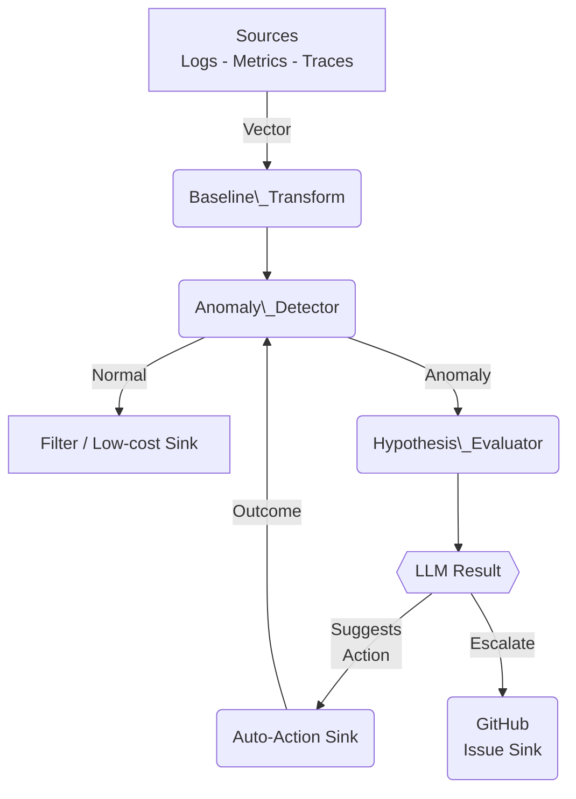
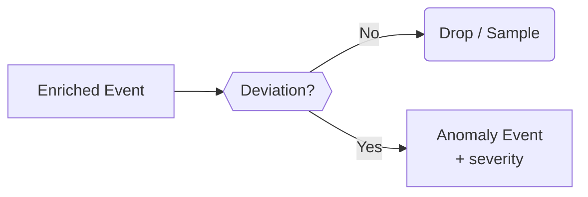
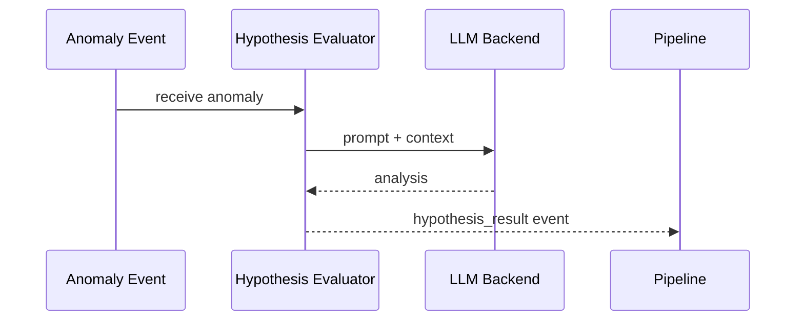
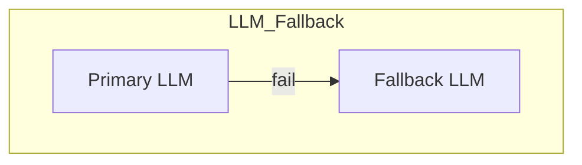
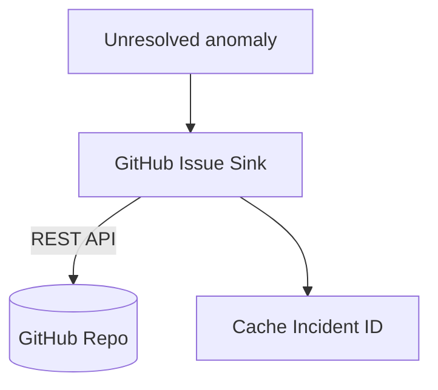
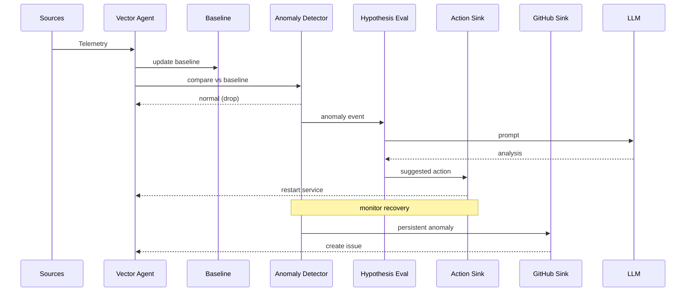
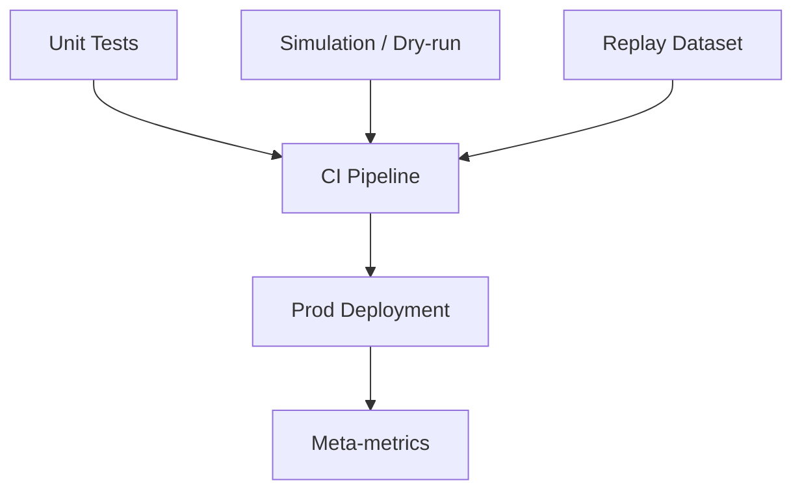

# Vector-Based Pluggable Observability Reduction Framework

*Date generated: 2025-06-18*

---

## Table of Contents
1. [Introduction](#introduction)
2. [High-Level Architecture](#high-level-architecture)
3. [Component Design](#component-design)
   1. [Baseline Establishment](#baseline-establishment)
   2. [Anomaly Detection](#anomaly-detection)
   3. [Hypothesis / LLM Evaluation](#hypothesis--llm-evaluation)
   4. [Automated Self-Healing Actions](#automated-self-healing-actions)
   5. [Incident Escalation (GitHub Issues)](#incident-escalation-github-issues)
4. [Configuration & Plugin Interfaces](#configuration--plugin-interfaces)
5. [Interaction Flow Example](#interaction-flow-example)
6. [Batteries-Included Defaults vs Advanced Customization](#batteries-included-defaults-vs-advanced-customization)
7. [Testing & Debugging Strategy](#testing--debugging-strategy)
8. [Conclusion](#conclusion)

---

## Introduction

Vector is a high-performance observability agent capable of collecting, transforming, and shipping logs, metrics, and traces.  
This framework extends a **fork** of Vector to:

* Build **baselines** for normal behaviour  
* Detect **anomalies** locally and forward only relevant data  
* Evaluate **prompts / hypotheses** with user-chosen LLM back-ends (OpenAI, Azure, Ollama, etc.)  
* Trigger **edge self-healing** actions  
* Escalate unresolved incidents by creating richly populated **GitHub issues**  

The result is **lower telemetry cost** and **faster MTTR** with a "batteries-included, but hackable" philosophy.

## High-Level Architecture



*Data is filtered locally, only anomalies and their context are shipped.*

---

## Component Design

### Baseline Establishment
```mermaid
flowchart LR
    subgraph Baseline_Engine
        direction TB
        H[Historical Window<br/>(configurable)] --> M{{Model}}
        M -->|Expected Range| O
    end
    E[Incoming Metric] --> O[Compare] -->|Attach Baseline| F[Enriched Event]
    style Baseline_Engine fill:#f3f3f3,stroke:#999
```

* Learns normal range (mean ± σ, or seasonal model) per metric  
* Continuously updates; emits baseline meta every interval  

### Anomaly Detection

* Flags deviations persisting beyond `min_duration`  
* Only anomaly events flow further – saving egress cost  

### Hypothesis / LLM Evaluation


* Supports multiple back-ends via pluggable `LLMClient` interface  
* Fallback to secondary model if primary times-out  



### Automated Self-Healing Actions
```mermaid
flowchart LR
    AE[Anomaly / Hypothesis Result] --> T{{Match Trigger?}}
    T -->|Yes| ACT[Action Plugin<br/>(restart / scale / script)]
    ACT --> R{{Success?}}
    R -->|Yes| S[Emit recovery]
    R -->|No| N[Mark failed -> escalate]
```
* Pluggable action types (`exec`, `k8s_scale`, etc.)  
* Debounce / rate-limit & dry-run mode  

### Incident Escalation (GitHub Issues)

* Compiles timeline, logs, traces, LLM analysis  
* Avoids duplicate issues via incident ID cache  

---

## Configuration & Plugin Interfaces

```toml
# vector.toml  (excerpt)
[sources.host_metrics]
type = "host_metrics"

[transforms.baseline_cpu]
type = "baseline"
inputs = ["host_metrics"]
metric_name = "cpu_usage"
history = "7d"
model = "moving_average"

[transforms.detect_cpu]
type = "anomaly_detector"
inputs = ["baseline_cpu"]
metric_name = "cpu_usage"
threshold = "3_sigma"
min_duration = "5m"
```

```yaml
# hypotheses.yaml
hypotheses:
  - name: Memory Leak Suspected
    if_anomaly:
      metric: memory_usage
      condition: increasing_trend
    prompt: |
      Memory climbed from {{prev}} to {{cur}}. Is this a leak?
    on_confirm:
      action: restart_service
```

```yaml
# actions.yaml
sinks:
  - id: restart_service
    type: action
    action_type: exec
    command: "systemctl restart web-app"
    triggers: ["Memory Leak Suspected"]
    debounce: "10m"
```

Plugin traits (Rust-pseudo):

```rust
trait Transform {
   fn transform(&mut self, event: Event) -> Vec<Event>;
}

trait Sink {
   fn process(&self, event: Event);
}

trait LLMClient {
   fn complete(&self, prompt: &str) -> Result<String, Error>;
}
```

---

## Interaction Flow Example



---

## Batteries-Included Defaults vs Advanced Customization

```mermaid
flowchart LR
    subgraph Defaults
      D1[Host metrics] --> D2[Std baselines]
      D2 --> D3[Safe actions<br/>(restart)]
    end
    subgraph Power_User
      C1[Custom metrics] --> C2[Own baselines]
      C2 --> C3[Custom hypotheses]
      C3 --> C4[Custom actions]
    end
```

* **Defaults:** 1-week baselines, 3σ threshold, restart on crash-loops, standard GitHub issue template.  
* **Customize:** swap detection algorithm, add Jira sink, disable auto-actions, provide domain-specific prompts, etc.

---

## Testing & Debugging Strategy



* **Unit tests** for every plugin (baseline, anomaly, LLM, actions, GitHub)  
* **Simulation mode:** no side-effects, print would-do actions  
* **Replay:** feed historical incident data for regression tests  
* **Meta-metrics:** agent emits its own health stats  

---

## Conclusion

The extended Vector fork provides an **autonomous observability assistant** that:

1. Learns normal patterns and filters noise  
2. Flags anomalies and explains them with LLM reasoning  
3. Takes safe self-healing steps locally  
4. Escalates with rich GitHub issues when needed  

All while keeping telemetry costs low by shipping *only what matters*.

